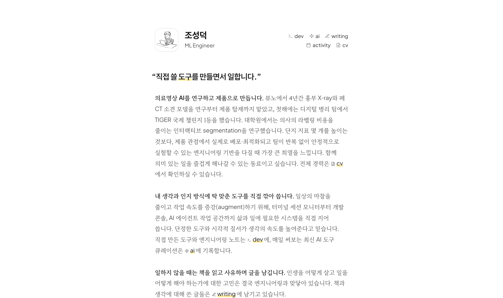

<div align="center">

# sungd.uk

조성덕의 대표 사이트 — 소개, 이력서, 활동

[**sungd.uk**](https://sungd.uk/) &nbsp;·&nbsp; [이력서](https://sungd.uk/cv/) &nbsp;·&nbsp; [English CV](https://sungd.uk/cv/en/) &nbsp;·&nbsp; [활동](https://sungd.uk/activity/)



</div>

<details>
<summary><b>개발</b></summary>

```sh
npm install
npm run dev       # localhost:4321
npm run cv-pdf    # 이력서 PDF 다시 굽기
```

```
src/pages/index.astro    첫 화면 (소개)
public/cv/               이력서 — 손으로 관리. 영문은 cv/en/
public/activity/         활동
```

- 이력서는 한국어와 영문을 같이 고친다. 같은 구조와 클래스를 쓴다.
- 경력 기간은 `data-from` / `data-to` 만 넣으면 오늘 날짜 기준으로 계산된다.
- 변천사는 `HISTORY.md`, 재편 배경은 `docs/reorg/`.

</details>

<details>
<summary><b>다른 사이트</b></summary>

- [dev.sungd.uk](https://dev.sungd.uk/) — 만든 것과 개발 노트
- [writing.sungd.uk](https://writing.sungd.uk/) — 책, 생각, 기술 글
- [books.sungd.uk](https://books.sungd.uk/) — 흩어진 책을 한 장에
- [ai.sungd.uk](https://ai.sungd.uk/) — 오늘 써 볼 AI 도구

</details>
